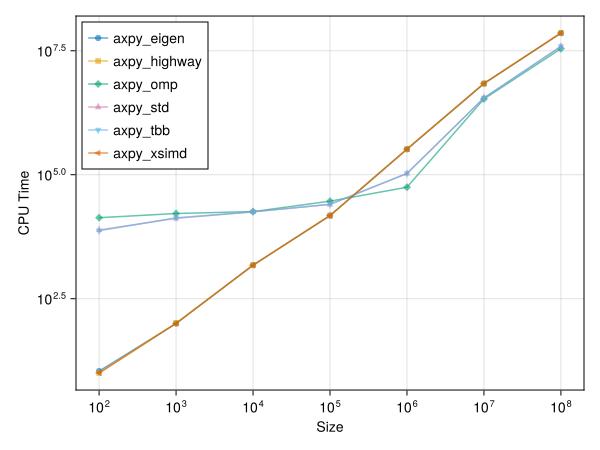
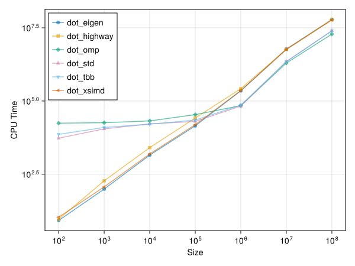
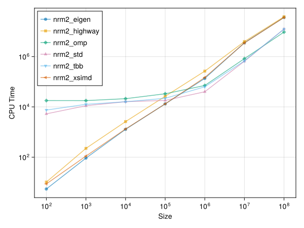
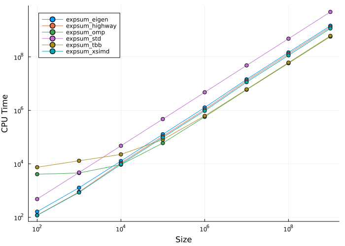

# 向量化计算库性能测试报告

## 实验环境与配置

- 测试平台：13th Gen Intel(R) Core(TM) i9-13900HX
- 硬件架构：24 Cores / 32 Threads
- 编译器：g++ 15.2.1
- 编译参数：见 [CMakeFile](CMakeLists.txt)
- 软件依赖：Highway (1.4.0), xsimd (14.0.0), Eigen (5.0.1), TBB, OpenMP

## 结果展示

AXPY ($Y = aX + Y$): 经典的向量加权累加，测试内存访问吞吐量与 FMA 指令流。

DOT (点积): 测试跨通道（Across-lane）规约效率。

NRM2 (L2 范数): 测试单向量平方累加的稳定性与速度。

SumExp ($\sum e^{x_i}$): 测试 SIMD 数学函数逼近（Polynomial Approximation）的性能，属于重度计算任务。

## 核心性能指标汇总 (Big-O Analysis)

下表展示了各库实现在大规模数据下的渐进时间复杂度系数（单位：ns/N）。该系数越小，代表吞吐量越高。(注：对于拟合结果为 $N\lg N$ 的多线程库，取 $N=10^8$ 时的实际每元素耗时进行近似换算，以便于横向对比)

| 实现方式 | AXPY (ns/N) | DOT (ns/N) | NRM2 (ns/N) | SumExp (ns/N) |
| --- | --- | --- | --- | --- |
| Eigen (单线程 SIMD) | 0.72 | 0.61 | 0.36 | 1.54 |
| Highway (单线程 SIMD) | 0.72 | 0.60 | 0.39 | 1.29 |
| xsimd (单线程 SIMD) | 0.72 | 0.60 | 0.36 | 1.51 |
| OpenMP (多核并行) | ~0.40 | 0.26 | ~0.14 | ~0.51 |
| TBB (多核并行) | ~0.39 | ~0.25 | ~0.12 | 0.43 |
| std (C++ 并行算法) | ~0.39 | ~0.25 | ~0.12 | 0.42 |

## 算子深度对比分析

### 访存密集型：AXPY, DOT, NRM2

在单线程模式下，三大 SIMD 库（Eigen, Highway, xsimd）在内存瓶颈前的表现达到了惊人的一致：

- 内存带宽墙：对于 AXPY（读 X, 读 Y, 写 Y 三路操作），Eigen、Highway 和 xsimd 的成绩**全部精确卡在 0.72 ns/N**。这完美证明了在访存受限的算子中，无论 SIMD 库的指令封装多么精妙，最终的上限完全由 CPU 的 L1/L2 缓存带宽和内存总线决定。
- 访存开销递减：从 AXPY (三路操作 0.72 ns/N) 降级到 DOT (双路读取 0.60~ 0.61 ns/N)，再到 NRM2 (单路读取 0.36~ 0.39 ns/N)，耗时严格随着内存 I/O 压力的减小而线性降低。
- 多核对带宽的榨取：当引入多线程后，TBB 和 `std` 将 AXPY 的耗时压缩至 ~0.39 ns/N，几乎实现了对单核带宽（0.72）的翻倍利用；而在单路读取的 NRM2 中，更是降至极低的 ~0.12 ns/N。

### 计算密集型：SumExp

指数运算（`exp`）极大考验了 CPU 的浮点计算单元与库的向量化数学函数实现：

- Highway 的算法优势：在单线程状态下，**Highway (1.29 ns/N)** 依然明显领先于 xsimd (1.51 ns/N) 和 Eigen (1.54 ns/N)。在超越函数的近似求值（如泰勒展开或 Minimax 多项式）上，Highway 的指令排布更为极致。
- 并行框架的差异：虽然多核都带来了巨大提升，但 **TBB (0.43 ns/N) 和 std (0.42 ns/N)** 在这项任务上明显优于 **OpenMP (~0.51 ns/N)**。这可能源于 TBB/std 的任务窃取（Task Stealing）调度器在处理密集型计算块时，比 OpenMP 默认的静态/动态分块策略开销更低。

### 线程调度与并行开销

结合极小规模数据（N=100）时的表现来看，并行框架依然存在不可忽视的启动成本：

- TBB 和 `std` 并行算法在各项指标上高度重合（例如 SumExp 的 0.43 对比 0.42，NRM2 的 0.12 对比 0.12），再次印证了现代 C++ 编译器（如 GCC/Clang）在实现 `<execution>` 并行策略时，底层极大概率直接调用了 TBB。

## 结论

1. 策略选择：如果是简单的向量加法、点积（访存受限），**不同的 SIMD 库之间无明显差异**（它们都是 0.72 ns/N）。对于访存受限任务（如 AXPY），多核并行是突破单核带宽瓶颈的唯一途径。
2. 库推荐：如果核心循环中包含大量的 `exp`, `log`, `sin` 等复杂数学运算，单线程下优先考虑接入 Highway。
